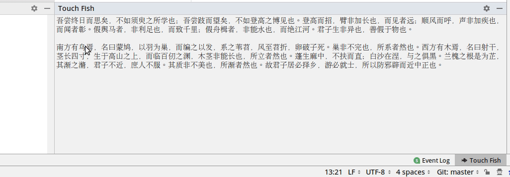
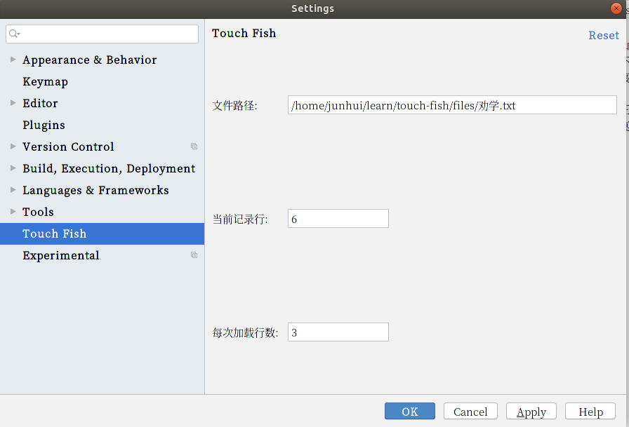

# touch-fish
一款jetbrains旗下的ide上touch fish(摸鱼)的插件,一般用来看小说?

# 效果图



# 安装
以IDEA为例:
```Intellij IDEA File——>Settings——>IDE setttings——>Plugins——>Install plugin from disk```

选择`touch-fish.jar`,完成后重启IDEA,可以看到IDEA下方工具栏(与Terminal同一行)里多了个`Touch Fish`了.  
`touch-fish.jar`文件请到[https://github.com/luojunhui/touch-fish/releases](https://github.com/luojunhui/touch-fish/releases)下载最新版,也可以下载本项目后自行编译.


# 使用

> 1. 打开settings下的`Touch Fish`,输入文本文件的`绝对路径`/当前记录行/加载行数后保存(如下图所示),然后重启IDEA.
> 2. 打开`Touch Fish`窗口,如无意外就能看到文本内容了.
> 3. 快捷键&uarr;向上读取内容,&darr;向下读取内容.



# 设置快捷键
给`Touch Fish`窗口加一个呼出隐藏的快捷键吧,
打开IDEA的```settings```里的```keymap```,
在搜索框内搜索`Touch Fish`后,
右键添加自定义快捷键.